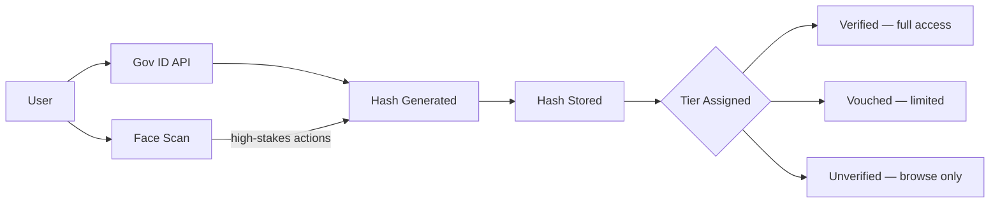
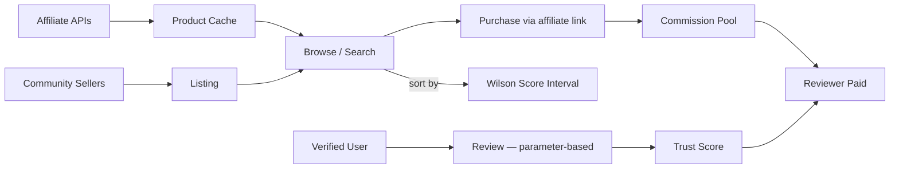
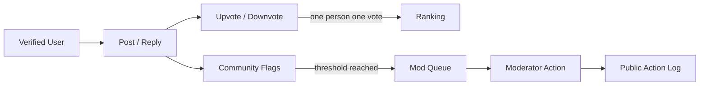
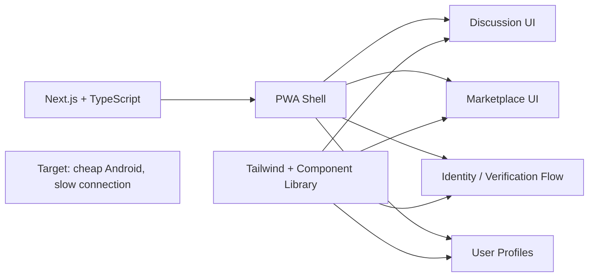

# Contributing

## Why build this

You earn **30-120x your raw hours** in revenue-share units. No equity — higher multipliers compensate for the risk of being early. Hours are recorded, multiplied by complexity and timing bonuses, and paid when revenue flows.

| Your work | What you earn (Year 1, first-10 contributor) |
|-----------|----------------------------------------------|
| 10 hrs fixing docs (routine) | 10 × 3 × 3 = 90 units |
| 10 hrs building features (standard) | 10 × 7 × 3 = 210 units |
| 10 hrs architecting systems (complex) | 10 × 12 × 3.5 = 420 units |
| 10 hrs designing ZK circuits (specialist) | 10 × 30 × 4 = 1,200 units |

Full details: [Builder Compensation](docs/joining/builder-compensation.md)

## 5-Minute Start

```bash
git clone https://github.com/thecounterweight/platform.git
cd platform/platform
pnpm install
cp .env.example .env  # Add your PostgreSQL connection string
pnpm prisma generate
pnpm prisma migrate dev
pnpm dev
# Open http://localhost:3000
```

Then:
1. Read the [one-page overview](docs/start-here/overview.md) — understand what this is
2. Pick a workstream below that matches your skills
3. Claim an [existing issue](https://github.com/thecounterweight/platform/issues) or propose one
4. Branch, build, PR
5. Your contribution is recorded on the public ledger from day one

No meetings. No approval to start. Show up, do the work, get credited.

## Workstreams

The project has four active workstreams. Each is independent enough to build in parallel. Pick the one that fits you.

### Identity



**What's decided:** Three-layer verification (government ID API + face scan for high-stakes + OTP). Non-reversible hash stored — no raw data. Three access tiers (verified/vouched/unverified). User pays verification fee. See [identity-verification.md](docs/building/identity-verification.md).

**What needs building:**
- DigiLocker / Aadhaar eKYC sandbox integration (India)
- Face liveness detection for high-stakes actions
- Hash generation and storage layer
- Vouching system (verified users vouch for others, accountability chain)
- Account recovery flow without storing personal data

**Skills needed:** Backend (Node.js/TypeScript), cryptography basics, government API integration, security mindset.

**Key constraint:** Privacy is non-negotiable. If your design requires storing personal data, it's wrong. Start over.

### Marketplace



**What's decided:** Aggregated products from Amazon/Flipkart via affiliate APIs + community sellers listing free. Reviews from verified humans only, parameter-based ratings, ranked by Wilson score interval. EigenTrust graph propagation for reviewer trust scoring. Reviewer commission from affiliate revenue. See [mvp.md](docs/start-here/mvp.md).

**What needs building:**
- Amazon Product Advertising API integration
- Flipkart Affiliate API integration
- Product aggregation and caching layer
- Review system (parameter-based, trust score, post-purchase verification)
- Affiliate link tracking and commission attribution
- Community seller listing flow
- Search and category browsing

**Skills needed:** Full-stack TypeScript, API integrations, search/filtering, UI/UX for e-commerce.

**Key constraint:** Wilson score interval determines sort order — statistically sound, accounts for both rating quality and sample size. No paid placement. No algorithmic manipulation. The code must make this obvious and auditable.

### Discussion



**What's decided:** Threaded discussion boards. Real people only. E2E encrypted DMs (MLS protocol). Real-time neural translation across languages. Moderation via ML triage + community vote (humans always make the final decision). See [mvp.md](docs/start-here/mvp.md) moderation section.

**What needs building:**
- Board/category CRUD
- Posts, comments, threaded replies
- Upvotes/downvotes (one person one vote, verified)
- Real-time updates (WebSockets)
- Moderation tools (flag, review queue, action log)
- User profiles with contribution history

**Skills needed:** Full-stack TypeScript, WebSockets, UI for discussion (threading, nesting), moderation tooling.

**Key constraint:** Every action is traceable to a verified human. Anonymous posting is allowed (you choose your display) but the system knows who you are. This makes moderation fundamentally different from Reddit/Twitter.

### Frontend & Design



**What's decided:** Next.js, TypeScript, Tailwind. Mobile-first PWA. Light theme. Minimal, fast, accessible.

**What needs building:**
- Mobile-responsive PWA shell
- Discussion board UI
- Marketplace UI (product cards, reviews, search)
- User profile pages
- Verification flow UI (step-by-step, reassuring about privacy)
- Design system / component library

**Skills needed:** React/Next.js, TypeScript, Tailwind, responsive design, accessibility, UX thinking.

**Key constraint:** Optimize for low-end Android phones on slow connections. Most of our users will be there.

## Roles

### First Contribution

You just showed up. You want to help.

1. Look at issues labeled `good first issue` in any workstream
2. Comment to claim it
3. Ask questions if anything is unclear — no one will judge you
4. Ship the PR. Get reviewed. Get merged. Get credited.

You don't need permission. You don't need to understand the whole system. Pick one thing, do it well.

### Workstream Lead

You own a workstream. This means:

- You've shipped multiple contributions in this area
- You break the big picture into scoped issues others can pick up
- You review PRs in your workstream
- You mentor newcomers — answer questions, unblock people
- You make small architectural decisions (library choice, module structure)
- You don't gatekeep. If someone shows up with good work, it gets merged.

**How you become one:** Show up first. Do the most work. No appointment needed. If two people both want to lead, the one with more shipped contributions leads. If there's genuine disagreement, the community votes.

**How you lose it:** Stop showing up for 30 days without notice, or the community votes you out (same no-confidence mechanism as everything else: 60% + 7-day discussion).

### Architect

Cross-workstream decisions. Technical design docs. Making sure identity integrates cleanly with marketplace, marketplace with discussion, etc.

**How you become one:** Lead a workstream well enough that people trust your judgment across boundaries.

## How Work Gets Created

This is the most important part. A project dies when there's work to do but no one knows what it is.

**Workstream leads create work for others:**
1. Take the "what needs building" list above
2. Break it into issues sized for 1-3 days of work
3. Write clear acceptance criteria (what does "done" look like?)
4. Label by difficulty: `starter` (first contribution), `medium` (familiar with codebase), `hard` (deep expertise needed)
5. Post it. Someone will claim it.

**Anyone can propose work:**
- See something missing? Open an issue.
- The workstream lead validates scope and assigns complexity
- If there's no lead yet, the community discusses

**The rule:** No issue should require reading more than one doc to understand. If it does, it's too big — break it down.

## How Seniors Help Juniors

If you're experienced:
- Write issues that teach. Include context: "this connects to X because Y"
- Review with kindness. Explain the *why* behind requested changes.
- Pair on hard problems. A 30-minute call saves days of frustration.
- Break your expertise into transferable pieces. Don't just build — enable others to build.

If you're learning:
- Claim `starter` issues. They're designed for you.
- Ask questions in the issue thread — the answer helps the next person too
- Your PR doesn't have to be perfect. That's what review is for.
- "I'm stuck" is a valid message. Say it early.

## Decision Making

**Small decisions** (library choice, implementation detail): Whoever's doing the work decides.

**Medium decisions** (module architecture, API design): Post in the relevant discussion. No objections in 48 hours = approved. Disagreement = GitHub Discussion + vote after one week.

**Large decisions** (overall architecture, governance, compensation): Formal RFC in GitHub Discussions. Minimum one-week discussion. Vote by active contributors (at least 1 contribution in past 30 days). Simple majority wins.

## Code Standards

- TypeScript with strict mode
- Tests required for new features
- PRs require at least one approval before merge
- CI must pass (lint + tests)
- Write code that others can read. If it needs a comment to explain, it might need a rewrite.
- Keep PRs focused. One feature or fix per PR.

## Compensation

Every contribution is tracked on a public ledger. When revenue flows, contributors get paid proportional to what they built. Not just code — reviews, design, documentation, moderation, mentoring all count.

Early contributors take more risk. They get multiplied units (up to 7x for the hardest foundational work). Read [Builder Compensation](docs/joining/builder-compensation.md) for the full model.

## Communication

- **Real-time:** Discord (link in README)
- **Persistent decisions:** GitHub Discussions
- **Video calls:** Jitsi Meet (links posted in Discord)

Rule: chat on Discord, decide on GitHub. If a Discord conversation reaches a conclusion, someone writes it up as an issue or discussion post. Otherwise it's lost.

## Code of Conduct

- Treat people with respect. Disagree with ideas, not people.
- No harassment, discrimination, or personal attacks. Zero tolerance.
- This is global and multicultural. Assume good intent across language and cultural barriers.
- Problems? Report to maintainers. It'll be handled.

## Questions?

Open an issue or ask in Discord. There are no stupid questions. We'd rather you ask than get stuck silently.
