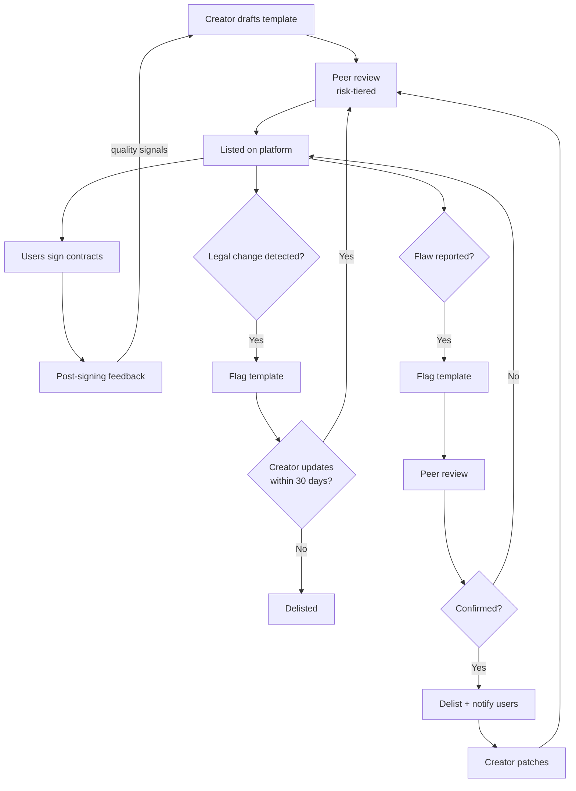
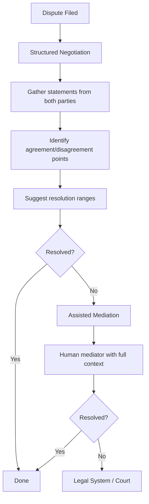

# Contracts

Verified identity + contract infrastructure = enforceable agreements between real people, without lawyers, without stamp paper, without the other party being a stranger.

This is what verified identity unlocks beyond reviews and discussion. Every person on the platform is a known, accountable human. That makes contracts between them meaningful, enforceable, and cheap.

## What the Platform Provides

1. **Template library** — Jurisdiction-aware, lawyer-reviewed contract templates. Community-contributed and continuously improved. Covers common use cases (see below).
2. **Digital signing** — Legally enforceable under IT Act 2000 Section 5 (India), US ESIGN Act, EU eIDAS. Both parties are verified real humans. Signatures are timestamped and immutable.
3. **Immutable storage** — Signed contracts cannot be altered post-signing. Cryptographically timestamped. Both parties retain access forever.
4. **Payment tracking** — Records that payments happened per contract terms. The platform does not process or hold money — it records that Party A confirmed receipt of ₹X from Party B on date Y.
5. **Reminders** — Payment due dates, contract expiry, renewal notices, milestone deadlines.
6. **Dispute resolution** — Mediation infrastructure (see below). Does not replace legal rights.

## What the Platform Does NOT Do

- Hold money or process payments (that's UPI/bank transfer/existing rails)
- Enforce contracts (that's the legal system)
- Guarantee performance or returns
- Act as a party to any contract
- Provide legal advice or recommend terms
- Vet, evaluate, or perform due diligence on either party

The platform is infrastructure. Like a notary — it verifies identity, witnesses the agreement, stores the document. It does not decide whether the agreement is wise.

## Use Cases

### Business Funding (Revenue Share)

A person has a business idea. They present their plan. Interested community members reach out, evaluate, and choose to back them via a signed revenue share contract.

Business pays X% of revenue for Y years, capped at Z total return. No ownership changes hands. Simple, low legal complexity. After the agreement period ends, the business is fully independent.

**Example:** A local carpenter needs ₹2 lakh for better equipment. Three community members each put in ₹66,000 via separate revenue share contracts — 5% of revenue for 3 years, capped at 1.5x return. Simple. Done.

### Business Funding (Equity)

For registered businesses (Private Ltd, LLP). Individual backers each sign equity contracts directly with the company. More complex — requires valuation agreement, legal structuring per jurisdiction, defined exit mechanism.

**Example:** A community grocery store registers as a Private Ltd. 50 people each invest ₹20,000 via individual equity contracts. Each owns their proportional share per company law.

### Freelancer Agreements

Verified client hires a verified freelancer. Scope, deliverables, payment terms, IP ownership — all in a signed contract. No ghosting (you're a real person with a reputation), no payment disputes without a trail.

**Example:** A designer takes on a branding project. Contract specifies: 3 deliverables, ₹15,000 total, 50% upfront + 50% on approval. Both parties sign. Platform tracks payment confirmations.

### Rental Agreements

Verified landlord and verified tenant. Monthly rent, deposit, maintenance responsibilities, notice period — digitally signed, stored immutably, legally enforceable.

**Why this matters in India:** 90%+ of rental agreements are informal (verbal or unsigned photocopies). A digital, verified, legally enforceable rental agreement for ₹50-100 replaces a process that currently requires stamp paper, a notary visit, and ₹500-2,000.

**Example:** Tenant signs a 11-month rental agreement. Platform sends monthly payment reminders. Both parties have an immutable record if disputes arise.

### Loan Agreements (P2P)

One verified person lends money to another. Interest rate, repayment schedule, default terms — all in a signed contract. The platform records payments as they happen.

**Example:** A friend lends ₹50,000 at 8% annual interest, repayable in 12 monthly installments. Both sign. Platform sends repayment reminders and records each payment confirmation.

**Note:** P2P lending regulations vary by jurisdiction. The platform provides the contract infrastructure. Compliance with local lending regulations (RBI guidelines in India, FCA in UK) is the responsibility of the parties. Templates include jurisdiction-specific disclosures where required.

### Partnership Agreements

Two or more verified people starting a business together. Roles, equity split, decision-making authority, exit terms, dispute resolution — all defined upfront.

**Example:** Three friends start a delivery service. Partnership agreement defines: equal equity, unanimous decisions above ₹1 lakh, any partner can exit with 90 days notice at book value.

### Service Agreements

Hiring a plumber, a tutor, a caterer, a photographer. Scope, timeline, payment, quality expectations — signed by both verified parties.

**Example:** Hiring a photographer for a wedding. Contract specifies deliverables (300 edited photos, 60-second highlight reel), timeline (2 weeks post-event), and payment (₹25,000, 50% advance).

### NDAs and Confidentiality

Verified parties signing non-disclosure agreements for consulting, freelance, or business discussions. Enforceable because both parties are identified.

### Co-Ownership Agreements

Multiple people buying something together — property, equipment, vehicles. Ownership shares, usage rights, maintenance responsibilities, exit mechanism.

### Employment Contracts

Small businesses hiring employees. Salary, role, notice period, non-compete (where enforceable), benefits. Particularly useful for businesses that can't afford HR departments.

## How It Works (Any Contract Type)

1. Party A selects a template (or starts from blank)
2. Both parties negotiate terms on-platform (chat, document collaboration)
3. Final terms are locked — both parties review
4. Both parties sign digitally (verified identity = legally valid signature)
5. Contract is stored immutably — both parties can access anytime
6. Platform sends reminders per contract terms (payment dates, milestones, expiry)
7. If disputes arise → mediation infrastructure available

### Template Lifecycle

## Dispute Resolution (Structured ODR + Human Mediation)

Online Dispute Resolution (ODR) infrastructure — not just "talk it out," but structured tooling that resolves most disputes without courts while preserving legal enforceability.

**Resolution layers, in order:**

1. **Structured negotiation (automated)** — The platform guides both parties through a structured process: gather each side's statement, identify points of agreement/disagreement, suggest resolution ranges based on similar past cases (anonymized precedent database). Many disputes resolve here because the structure forces clarity. No human mediator needed.

2. **Assisted mediation** — If negotiation fails, elected mediators step in with full case context already organized. The system surfaces relevant precedent, contract terms, and payment history — mediators focus on judgment, not information gathering. Fast, accessible, free for the first attempt.

3. **Legal system** — The agreement is a signed contract, enforceable in court. Either party can go to court at any time — platform mediation doesn't waive legal rights.

### ODR Flow

**Why structured ODR, not just "talk it out":**

At scale (thousands of disputes/month), unstructured mediation doesn't work — mediators burn out, response times grow, quality varies. Structured ODR (the model used by eBay, Modria/Tyler Technologies, and the EU ODR platform) resolves 80%+ of disputes at layer 1 without human intervention.

**What the system does:**
- Collects structured statements from both parties (guided questions, not freeform)
- Identifies contract terms relevant to the dispute
- Surfaces anonymized outcomes from similar past disputes ("in 73% of similar cases, the resolution was...")
- Suggests settlement ranges both parties can accept/reject
- Escalates to human mediator only when structured negotiation fails
- Tracks mediator quality (resolution rate, satisfaction, time-to-resolution)

**What the system does NOT do:**
- Make binding decisions (humans decide, always)
- Replace legal rights (court is always available)
- Use AI to "judge" who is right (it organizes information, not adjudicate)

The goal is to resolve most disputes without courts (which are slow, expensive, and inaccessible to most people). But legal enforceability is never taken off the table.

## Revenue Model

| Service | Fee | Who pays |
|---------|-----|----------|
| Contract creation + signing | ₹50-200 per contract (varies by complexity) | Split between parties or paid by initiator |
| Storage + reminders | Free (included in creation fee) | — |
| Template access | Free (community-contributed) | — |
| Dispute mediation | Small fee per case | Split between parties |
| Bulk contracts (businesses) | Monthly plan | Business |

Fees are set at actual infrastructure cost + small margin. All fees are public, comparable across jurisdictions, and adjustable by governance vote.

## Business Funding — Additional Details

Business funding contracts deserve additional detail because they carry more risk than service or rental agreements.

### Deal structures for business funding

**Revenue share (default, simplest)**

Business pays X% of revenue for Y years, capped at Z total return. No ownership changes hands. Works for most small businesses. Available everywhere from day one.

**Equity (for registered businesses)**

Individual backers sign equity contracts directly with the registered company. Requires: valuation agreement, legal structuring per jurisdiction, defined exit mechanism in the contract.

**Convertible (hybrid)**

Start with revenue share. If the business hits agreed milestones, converts to equity at a pre-agreed valuation. Lower risk early, upside later.

### Risk disclosure (business funding only)

Business funding carries real risk. Not every business will succeed.

- The loss is absorbed by the individual who signed the contract. No debt to the business founder — the backer took that risk knowingly.
- Do not put money into business funding contracts that you cannot afford to lose.
- Positions are illiquid until the business pays out per contract terms.
- The platform does not guarantee returns, vet businesses, or recommend deals.

### Why the platform is not an investment platform

The platform provides contract infrastructure. People can use that infrastructure to fund businesses — just as they can use it to sign rental agreements or freelancer contracts. The platform is agnostic to contract type.

This distinction matters legally:
- The platform does not solicit investment or match investors with businesses
- The platform does not pool capital (SEBI CIS risk)
- The platform does not recommend, vet, or perform due diligence (SEBI Investment Adviser risk)
- The platform does not operate a marketplace for investment positions (stock exchange function)
- A business posting a pitch is the same infrastructure as a freelancer posting availability — the platform connects verified people, they decide what contracts to sign

### Cross-border contracts

Cross-border contracts involving money (business funding, loans) are subject to foreign exchange laws (FEMA in India, Capital Markets Act in Kenya, FATF guidelines globally).

**The rule:** Cross-border financial contracts are facilitated only for registered entities in sectors where both countries' laws permit the transaction.

Domestic contracts have no such restriction — a rental agreement, service contract, or revenue share between people in the same country uses the same infrastructure regardless of entity registration.

The platform starts domestic-only for financial contracts. Cross-border activates country-pair by country-pair, only where local law permits.

## Legal Basis

Digital contracts signed by verified parties are legally enforceable under:
- **India:** IT Act 2000 Section 5 (electronic signatures valid), Indian Contract Act 1872 (capacity, consent, consideration)
- **US:** ESIGN Act, UETA (electronic signatures equivalent to physical)
- **EU:** eIDAS Regulation (electronic identification and trust services)
- **Most jurisdictions:** Have equivalent electronic signature legislation

The platform's verified identity layer provides stronger authentication than most e-signature services (which often accept email-only verification). Every signatory is a government-ID-verified unique human.

## What's NOT Built Yet

Contract infrastructure is Phase 2 — it requires:
- Verified identity layer (Milestone 2)
- Lawyer-reviewed templates per jurisdiction
- Digital signing infrastructure
- Immutable storage
- Payment tracking integrations

It does not ship with the MVP. The MVP (discussion + reviews) builds the community and trust. Contracts activate when the identity layer is solid and templates are ready.

## Template System

### How Template Creators Get Paid

Lawyers and domain experts create contract templates. They earn per usage — every time someone signs a contract using their template, the creator gets paid.

**Payment model:**
- Creator sets their per-use fee (within platform guidelines based on complexity tier)
- Fee is included in the contract creation cost paid by users
- Platform takes a small operational cut (covers hosting, signing infrastructure, storage)
- Creator earns for the lifetime of the template (as long as it remains listed and current)

**Credential requirements:**
- Verified identity (same platform system as everyone)
- Demonstrable legal qualification (bar membership, law degree, or equivalent domain expertise)
- Jurisdiction declaration (which jurisdictions this template covers)
- No anonymous template creation

### Template Liability

Three parties, clear responsibilities:

| Party | Role | Liability |
|-------|------|-----------|
| **Platform** | Infrastructure — hosts, distributes, collects fees | No liability for template content. Platform is infrastructure (like DocuSign doesn't guarantee document content). Explicit disclaimers on every template. |
| **Template creator** | Professional work product for compensation | Professional liability for flawed templates. Covered by their professional indemnity insurance. Creator accepts liability terms when listing. |
| **Users** | Choose template, negotiate terms, sign | Caveat emptor — but with guardrails (plain-language summaries, cooling-off periods, peer-reviewed templates). |

**Platform's duty:** Disclaimers on every template ("this is infrastructure, not legal advice"), version tracking, notification if a flaw is discovered, maintenance reserve for orphaned templates.

### Risk Tiering

Different contract types carry different risk. Review rigor scales accordingly:

| Tier | Examples | Peer reviewers required | Creator credentials |
|------|----------|------------------------|---------------------|
| Low-risk | NDA, simple service agreement, receipt | 1 qualified reviewer | Legal background or domain expertise |
| Medium-risk | Rental, freelancer, partnership | 2 qualified reviewers | Practicing lawyer in declared jurisdiction |
| High-risk | Equity, P2P lending, cross-border, co-ownership | 3 qualified reviewers | Specialist in domain + jurisdiction. Mandatory plain-language summary. |

### Quality Control

**Before listing:**
- Peer review by qualified professionals (number depends on risk tier)
- Plain-language summary required (reviewed separately from legal text)
- Jurisdiction tagging with specific applicability declarations
- Mandatory fields validation rules defined by creator

**Ongoing quality signals:**
- **Usage analytics** — where users abandon filling in a template, which clauses get modified most often. Signals confusion or poor drafting. Visible to creator.
- **Modification tracking** — if 40%+ of users change the same clause, the template needs updating. Platform surfaces this to creator.
- **Post-signing feedback** — "Did this contract work as expected?" collected 6 months after signing. Low scores trigger peer re-review.

**Maintenance requirements:**
- **Legal change monitoring** — when a relevant law changes (new rent control act, IT Act amendment, RBI circular), affected templates are auto-flagged. Creator has 30 days to update or template is delisted.
- **Sunset rule** — templates expire after 2 years without re-certification. Laws change. A 2024 template shouldn't be used in 2027 without someone confirming it's still valid.
- **Orphan protection** — if a creator disappears (dies, delists, becomes unreachable), platform uses maintenance reserve (10-15% of template fees) to fund a replacement professional to patch or maintain the template. Affected users are notified.

### Flaw Discovery Process

When a template issue is reported:

1. Template is flagged (visible to new users considering it)
2. Creator is notified — has 7 days to respond
3. Peer review panel assesses whether the flaw is real
4. If confirmed: template is delisted for new contracts, creator patches it, patched version goes through re-review
5. All users who signed contracts using the flawed version are notified with an explanation of the issue and its practical impact
6. Template only relisted after peer review confirms the fix

### User Protection

**Cooling-off period (high-risk contracts only):**
- Lending, equity, cross-border: 48-hour window after signing where either party can withdraw without penalty
- Standard in consumer protection law (EU has 14 days for distance contracts)
- Prevents pressure-signing and impulse decisions on high-stakes agreements
- Low-risk contracts (service agreements, NDAs) have no cooling-off — parties need fast execution

**Signing safeguards:**
- Platform refuses to process if critical fields are blank or contradictory
- Contracts above ₹1 lakh require face scan re-confirmation before signing (prevents account compromise from creating binding obligations)
- Plain-language summary must be acknowledged ("I understand what this contract does") before signing high-risk templates

**No self-dealing:**
- Template creator cannot be a party to contracts using their own template (conflict of interest)
- Prevents creators from designing templates that favour one side and then being that side

### Multi-Language Templates

- Templates can exist in multiple languages with legal equivalence declared by the creator
- Legal text must be human-translated by a qualified professional (not neural MT — legal precision matters)
- Platform's translation layer handles UI chrome around the template, but the contract text itself is professional translation only
- If parties sign in different languages, the governing language is declared in the template (standard international contract practice)

### Versioning

- Every template is versioned (v1.0, v1.1, v2.0, etc.)
- Signed contracts reference the exact version used — immutable
- When a new version is published, existing contracts are unaffected
- Users of older versions are notified if a newer version fixes known issues
- Version history is public — anyone can see what changed and why

## Open Questions

- **Regulation at scale:** The platform hosts templates and records contracts — it doesn't match, solicit, or recommend. P2P lending as a regulated activity (RBI NBFC-P2P, FCA authorization) is an ecosystem-level concern for third parties building on the ZK identity layer, not for the contract infrastructure itself. Same distinction as DocuSign hosting loan documents without being a lender. Worth monitoring, but likely not a platform risk.
- **Fee structure:** Exact per-use fees per complexity tier need market research. The principle (creator sets fee within guidelines, platform takes operational cut) is set; the specific ranges are not.
- **Stamp duty:** Where jurisdictions require stamp duty (state-dependent in India, varies globally), the platform integrates e-stamp procurement as part of the contract creation flow. Handled per-template, per-jurisdiction — template creators declare stamp duty requirements, platform facilitates payment through the relevant state portal. Cost passed to users. Not a platform-level design question — it's operational, handled case by case.
- **Cross-border enforceability:** Enabled piece by piece, country-pair by country-pair, as legal research confirms mutual recognition of e-signatures. Aspirational goal — domestic-first, cross-border when and where we can.

If you're a lawyer in any jurisdiction — template contribution is one of the highest-value things you can do. Paid per use, for as long as the template is active.
