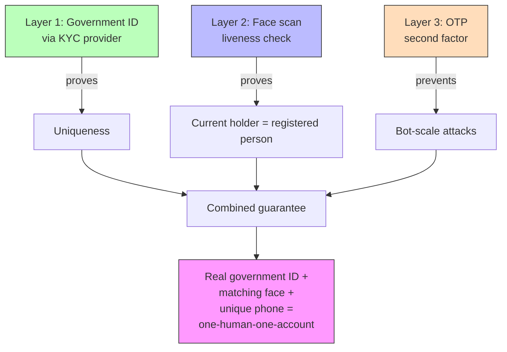
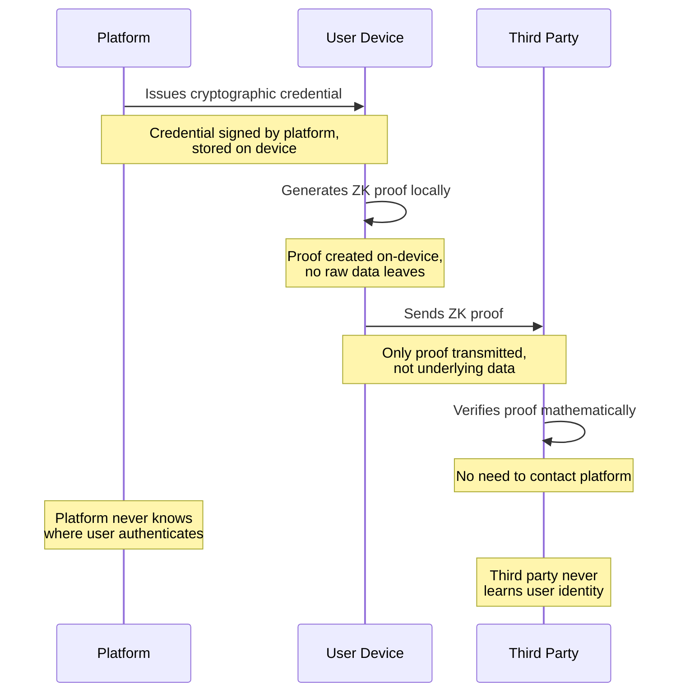

# Identity Verification

How we ensure one person = one account without compromising privacy.

## The Requirement

Every account on the platform must belong to a unique, real human. This is non-negotiable — voting, investment, certification, and community trust all depend on it.

## Proposed Design (Three Layers)

### Layer 1 — Government Identity Verification

Verification is handled through existing KYC providers who already have government API access:

- **India:** Digio, Signzy, IDfy, or similar — they hold DigiLocker/Aadhaar eKYC licenses. We use their APIs. No license needed on our end.
- **EU:** eIDAS-compliant providers (Onfido, Jumio, etc.)
- **UK:** GOV.UK Verify via authorized identity providers
- **US:** ID.me, Persona, or similar
- **Others:** Added as the platform expands — always through a licensed local provider

The platform does not hold a government API license directly. We integrate with providers who do. This removes the regulatory dependency — no 12-18 month license wait, no risk of denial. If one provider is unavailable, we switch to another.

**Cost:** KYC providers charge ₹5-20 per verification in India, $1-3 elsewhere. Passed to the user as a one-time registration fee.

**What this proves:** You are a real person with a government-issued identity. You are unique (no duplicate accounts).

### Deduplication — How "One Person, One Account" Actually Works

The one-account guarantee requires detecting if someone has already registered. Different strategies for different situations:

**Primary (India — 95% of users): HMAC of Aadhaar number**

1. User verifies via KYC provider (Digio/Signzy). Provider returns the Aadhaar number as part of verification.
2. Platform immediately computes HMAC-SHA256(server_secret_key, aadhaar_number).
3. Raw Aadhaar number is discarded — never stored, never logged.
4. The HMAC is checked against existing records. Match = duplicate account attempt, rejected.
5. No match = new user, HMAC stored.

Why HMAC and not plain hash: Aadhaar is 12 digits (10^12 possibilities) — a plain SHA-256 hash is brute-forceable in hours. HMAC with a secret key means the hash cannot be reversed without the key. Key is stored in a hardware security module (HSM) or secrets manager, separate from the database.

**Fallback (no Aadhaar, international users): Face deduplication (1:N matching)**

For users verifying with non-Aadhaar documents (Voter ID, Passport, PAN, international IDs):

1. User completes verification + face scan via KYC provider.
2. Provider performs 1:N face matching — checking the new face against ALL previously registered faces in their system.
3. Match found = duplicate account attempt, rejected.
4. No match = new user, enrolled in provider's face registry.

The platform never stores face embeddings or biometric templates. The KYC provider maintains the face registry and performs dedup checks — returning only pass/fail to the platform. This creates provider lock-in for these users (face embeddings aren't portable between providers), but since Aadhaar-based dedup covers 95% of Indian users, the lock-in affects only edge cases.

**Why not use one method for everyone:**
- HMAC-of-ID-number is simpler, cheaper, provider-portable, and privacy-preserving — but requires a single universal ID number per country.
- Face dedup works across any document type but is more expensive (₹2-5 per 1:N check), creates provider lock-in, and depends on third-party biometric storage.
- The combination gives robust coverage: primary method is portable and cheap, fallback handles edge cases.

**International expansion:** Each country gets a primary dedup ID where one exists (SSN in US, National Insurance number in UK, BSN in Netherlands). Face dedup is the universal fallback for countries without a single dominant identifier.

**Provider switching (primary path):** The HMAC is stored in your database, computed with your key. If you switch KYC providers, deduplication continues working — the HMAC doesn't depend on which provider verified the user. Only face-dedup users are affected by provider changes.

### Layer 2 — Face Scan (Liveness Check)

For high-stakes actions (voting, large investments, governance decisions), communities can require a face scan that matches the government ID photo.

- Proves the person performing the action is the verified account holder
- Prevents account selling to bot farms
- Optional per community — not forced on every interaction
- Processed in real-time, biometric data discarded immediately after pass/fail

**What this proves:** The person using the account right now is the person who registered it.

### Layer 3 — OTP (Bot Friction + Second Factor)

One phone number per account at registration. OTP is a second factor, not the primary auth.

- Makes scaling attacks expensive (each fake account needs a unique SIM)
- Acts as second factor for login on new devices (not primary authentication)
- Standard SMS or authenticator app

**What this does NOT do:** OTP alone does not grant account access. A recycled or swapped SIM cannot be used to take over an account.

**Login model:**
- Primary auth: password or passkey (set at registration)
- Second factor: OTP on new devices only
- Sessions: long-lived on trusted devices — no OTP required for every login
- Sensitive actions (voting, investment, governance): face scan (Layer 2)

**SIM recycling / swap protection:**
- Login from new device requires password + OTP (not OTP alone)
- If OTP delivery fails (number recycled), account remains accessible via password on existing sessions
- Rebinding to a new phone number requires full re-verification (gov ID + face scan)

**Shared phone households:**
- Account is tied to person (gov ID), not to phone
- Phone is the current login channel, not the identity anchor
- If someone later gets their own device, they rebind via gov ID + face scan

**What this proves:** Bot farms can't operate at scale without massive SIM acquisition. Legitimate users aren't locked out by SIM issues because identity lives in Layer 1, not Layer 3.

### Combined Effect

To game the system you would need: a real government ID + a face that matches it + a unique phone number — per account. This is effectively one-human-one-account.

### Verification Layers

## Privacy Guarantees

These are non-negotiable platform commitments:

| Guarantee | What it means |
|-----------|---------------|
| No storage of raw documents | The platform verifies and discards. No passport scans, no Aadhaar numbers stored. Raw ID numbers are processed in memory and immediately discarded after HMAC computation. |
| No selling or sharing | Identity data never leaves the platform. Never sold to third parties. Never used for advertising. |
| No profiling from verification | Verification itself is a yes/no gate — nothing is extracted from your ID beyond the HMAC. Attributes (age bracket, district, gender) are only stored if you explicitly opt in later. |
| Minimum data principle | Only an HMAC (keyed hash) of your ID number is stored — enough to prevent duplicate accounts, nothing more. The raw number is never persisted. |
| Non-reversible storage | Even if the database leaks, no one can reverse the HMAC to your ID number without the secret key (stored separately in HSM/secrets manager). |
| Face data: platform never stores | For face-dedup users, the KYC provider maintains face embeddings for 1:N matching. The platform receives only pass/fail — no biometric data touches our systems. |
| Liveness checks not retained | Liveness checks for high-stakes actions produce pass/fail. Biometric data is processed in real-time by the provider and discarded. |
| Open-source verification logic | Anyone can audit exactly what data flows where. No black boxes. |

## Two Paths: Anonymous or Public Identity

The platform knows you're real. What others see is your choice.

### Path 1: Anonymous Participation

- Post, comment, and participate under a pseudonym.
- The system guarantees to others: "this is a verified unique human" — without revealing who.
- Contracts require real names (legal necessity). Community discussion does not.
- Verified attributes (age bracket, district) can gate access to spaces without revealing your identity to other members.

Pseudonymous participation with verified-human backing. Privacy without enabling manipulation.

### Path 2: Public Profile — Citizen of the World

You can also choose to show up as yourself. The profile you build over time becomes useful.

**What a public profile is:**

A reputation ledger. It accumulates from what you *do* on the platform.

| What others see | How it's built |
|-----------------|----------------|
| Where you're from (granularity you choose: country, state, or city) | From your verified attributes |
| How long you've been verified | Timestamp of verification |
| Review accuracy (% of reviews rated helpful/accurate by peers) | Computed from peer ratings |
| Trust score | EigenTrust graph propagation |
| Communities you participate in | Your activity |
| Skills you're certified in | Expert evaluations |
| Contributions to the platform | Public ledger |

**Why this matters:**

"Verified user from Jaipur, Rajasthan — 2 years on platform, 94% review accuracy, certified solar installer" — that carries weight a username never will. It's backed by verified identity and observable history.

**What a public profile is NOT:**
- Not a social media feed
- Not mandatory (anonymous path has full access to all features)
- Not a data extraction tool (profile shows what you choose, nothing is inferred)
- Not performative (you can't pad it — every line comes from verifiable platform activity)

**The incentive structure:**

Anonymous users have full access. Public profiles accumulate *standing*. When someone from Rajasthan writes a review of a local electrician, or when a certified plumber answers a question — the credibility is visible. Connections (professional, community, geographic) compound over time.

**Granularity controls:**
- Location: choose country only, state, or city — change anytime
- Real name: optional, can use first name only, or full name
- Activity: choose which communities, certifications, and contributions are visible
- Connections: mutual consent required — both parties agree to be publicly connected

## Verification = Constitutional Rights

Completing identity verification grants you constitutional rights on the platform. These rights are encoded in the company's Articles of Association / Operating Agreement — legally enforceable, not just a Terms of Service promise.

**What happens at verification:**
1. KYC provider confirms your identity
2. You're shown the platform constitution: your rights, the governance model, and what protections exist
3. You accept the terms (digitally signed, enforceable)
4. You're enrolled as a verified user with full constitutional rights

**What verification gives you:**
- One vote in all governance decisions (elections, amendments, no-confidence)
- Right to stand for elected positions (moderator, safety team, community lead)
- Legal standing to sue if the company violates its constitutional commitments
- No citizenship or residency requirement — works for any nationality

**Why this works:**
- No separate "join" process — verification IS activation of rights
- Every verified user has constitutional protections by default
- Rights are in the Articles/OA, not the Terms of Service — they cannot be unilaterally revoked
- An irrevocable purpose trust holds a golden share preventing sale, mission change, or removal of these rights — trustees are independent of the founder, and the user-elected advisory board's recommendation binds the trust
- International by design — no membership in a foreign entity required

**Why not user ownership:**
We explored making every user a legal co-owner (member-governed LLC). It doesn't work at scale — no precedent for million-member LLCs, tax filing nightmare (K-1s for every member), near-impossible to raise capital, FEMA ambiguity for Indian members. The trust model (proven by Patagonia, Signal, Mozilla) gives users equivalent structural protection without requiring them to be shareholders of an entity they'd never meaningfully control.

## Cost

Identity verification APIs charge per check (₹5-20 in India, $1-3 elsewhere). A small fee covers the verification cost and serves as a minor friction barrier against frivolous account creation.

## Account Recovery

**Phone lost or number changed (still have password):**
1. Log in with password on a new device.
2. Bind a new phone number (requires face scan to confirm identity).

**Password forgotten (still have phone):**
1. OTP to existing number + face scan → reset password.

**Both lost (phone and password):**
1. Re-verify with government ID through the same API.
2. Complete a face scan matching your original verification.
3. Set new password, bind new phone number.

In all cases, you must prove you're the same person. A recycled SIM alone never grants access — the new SIM owner cannot log in without the password, and cannot reset the password without passing a face scan against the original verified identity.

## Age Threshold

- Community features (discussion, marketplace, reviews, certification): No platform-imposed age minimum.
- Investment and contract features (backing businesses, signing investment agreements): 18+ or legal age of contract in the user's jurisdiction.
- Where local law imposes age restrictions on platform access (e.g., France requires parental consent for under-15 on social platforms), the platform complies with those requirements.

Age is verified through the government ID layer during registration. Jurisdictional restrictions are applied based on the user's verified location.

## People Without Government ID

An estimated 850 million people globally lack government-issued ID. The platform must still be useful to them without compromising the trust guarantees that verified identity provides.

**Access tiers:**

| Tier | Requirement | Can do | Cannot do |
|------|-------------|--------|-----------|
| Verified | Government ID + OTP | Everything — review, vote, invest, sell, certify, govern | — |
| Vouched | N verified members vouch + OTP | Discussion, chat, browse marketplace, buy (not sell) | Review, vote, invest, sell, certify, govern |
| Unverified | Email/phone only | Browse, read, search | Participate in any way that requires trust |

**Why three tiers:**

The platform's value comes from verified identity — trusted reviews, one-person-one-vote, no bots. Weakening this weakens everything. But reading, browsing, and buying don't require the same trust guarantees as reviewing, voting, or investing. People without ID can still benefit from the platform. They just can't do things that require others to trust their uniqueness.

**Vouched tier:** If N verified members (community decides the threshold — likely 3-5) personally vouch for someone, that person gains limited participation rights. This isn't full verification — it's a social trust layer. Vouchers are accountable: if the vouched person turns out to be a duplicate or bot, vouchers lose reputation.

**Path to full access:** As governments expand digital ID systems (India went from ~50% to ~95% Aadhaar coverage in a decade), more people gain access to full verification. The platform doesn't solve the ID gap — it works within it while remaining useful to those affected.

## Verified Attributes (Opt-In)

Verification produces a pass/fail and a deduplication HMAC. Nothing else is extracted from your ID. But users can opt in to sharing categorical attributes that make the platform more useful — enabling features like geo-fenced voting, identity-gated communities, and age-appropriate spaces.

### What Gets Stored (Only If You Opt In)

| Attribute | Granularity | What's stored | What's NOT stored |
|-----------|-------------|---------------|-------------------|
| Age | Bracket (18-25, 26-35, etc.) | Age bracket only | Date of birth, exact age |
| Location | District / city | District name | Street address, pin code, GPS |
| Gender | Category | Self-declared gender | — |
| Language | Languages spoken | Language list | — |

**Key principles:**
- **Categorical, not precise.** District not address. Age bracket not DOB. Enough for the feature to work, not enough to identify you.
- **Opt-in, not extracted.** Attributes are never pulled from your government ID during verification. You provide them separately, after verification, if you choose to.
- **Revocable.** Remove any attribute at any time. Immediate deletion, not just hidden.
- **Never exported.** Attributes are used on-platform only. No API exposes them to third parties. No advertising, no profiling, no data sales.
- **Purpose-trust protected.** The irrevocable purpose trust prevents any future leadership from changing these data practices — selling data would violate the trust deed and trigger trustee intervention.

### What This Enables

- **Geo-fenced governance** — Vote in decisions that affect your district/city
- **Identity-gated communities** — Women-only spaces, age-appropriate boards (verified, not self-claimed)
- **Collective purchasing** — Group nearby shopkeepers without revealing exact locations
- **Localized marketplace** — Surface relevant sellers and products
- **Age compliance** — Enforce jurisdiction-specific age restrictions without storing DOB

### Hard Boundaries (Never Stored, Never Asked)

These attributes are NEVER collected, stored, or derived — regardless of user consent:

- **Caste**
- **Religion**
- **Political affiliation**
- **Sexual orientation**
- **Health status / disability**
- **Income / financial status**

No feature on this platform will ever require these. If a use case seems to need them, the use case is redesigned or rejected. This is a constitutional constraint — encoded in the trust deed, not just a policy decision.

### Data Trust Guarantees

| Guarantee | How it's enforced |
|-----------|-------------------|
| Open-source attribute logic | Anyone can audit exactly what's stored and how it's used |
| Third-party audits | Annual independent audit of data practices (published publicly) |
| Cryptographic deletion proofs | When you revoke an attribute, the platform generates a verifiable proof of deletion |
| Purpose trust protection | Trust deed explicitly prohibits selling, sharing, or monetizing user attributes — trustees can block any attempt |
| No derived profiling | The platform never combines attributes to build user profiles or segments |

## Identity as Infrastructure (Zero-Knowledge Proofs)

The platform's identity layer becomes useful beyond the platform itself — without compromising privacy.

### The Problem

External services (lending platforms, freelance marketplaces, co-ops) need to verify that a user is real, unique, and has certain attributes. Traditional approaches: (a) share raw data with third parties (privacy violation), or (b) the third party calls back to the platform to verify (the platform sees who authenticates where — surveillance).

### The Solution: ZK Proofs Generated On-Device

Zero-knowledge proofs let users prove attributes to third parties without revealing the underlying data, and without the platform knowing which third parties they authenticate with.

**How it works:**

1. User has verified attributes stored on-platform (age bracket, district, etc.)
2. User downloads a cryptographic credential to their device (signed by the platform)
3. When a third-party service needs proof (e.g., "this person is 18+"), the user's device generates a ZK proof locally
4. The third party verifies the proof cryptographically — no need to contact the platform
5. The platform never knows which third parties the user authenticated with (unlinkability)

**What can be proved without revealing:**

| Third party needs to know | What's revealed | What's NOT revealed |
|---------------------------|-----------------|---------------------|
| "User is 18+" | True/false | Exact age, DOB, name |
| "User is in Maharashtra" | True/false | District, address |
| "User is a unique human" | True/false | Identity, any personal data |
| "User has 4+ star trust score" | True/false | Exact score, review history |

### Building Blocks

- **Anon Aadhaar** — ZK proofs over Aadhaar QR codes (already implemented by PSE/Ethereum Foundation for Indian identity)
- **Semaphore** — Anonymous group membership proofs (prove "I'm in this group" without revealing which member)
- **circom / snarkjs** — Circuit compiler and prover for custom attribute proofs
- **On-device proving** — Proofs generated on user's phone/laptop. Platform servers never involved in proof generation.

### Architecture

### Phased Rollout

| Phase | What | When |
|-------|------|------|
| Milestone 2 | Verified attributes on-platform (opt-in, categorical) | With identity verification launch |
| Phase 2 | ZK credential issuance + on-device proof generation | When core platform is stable |
| Phase 2+ | Ecosystem SDK for third parties to verify proofs | After internal ZK infrastructure is proven |

### Ecosystem Revenue

- Community-serving instances (mutual aid, co-ops, non-profits) verify proofs for free
- Revenue-generating instances (lending platforms, freelance marketplaces) pay a proportional fee
- Fee ceiling is a constitutional bound (75% supermajority to change)
- The platform earns revenue from the identity layer without ever seeing or selling user data

### Why This Is Hard (And Why We Build It Anyway)

ZK proof infrastructure is complex — circuit design, trusted setup ceremonies, mobile-optimized provers, credential revocation. This is not a weekend project.

But the alternative is worse: either we don't provide identity as infrastructure (limiting the platform's value), or we provide it by sharing data with third parties (violating our privacy commitments). ZK proofs are the only architecture that satisfies both goals simultaneously.

We build this incrementally. Internal attributes first (simple, immediate value). ZK infrastructure when the team and revenue can support it. The design is ready — the implementation follows the platform's growth.

### Open Questions

- Credential revocation: what happens to issued credentials when a user revokes an attribute? (Likely: short-lived credentials with periodic refresh)
- Trusted setup: use existing ceremony (Hermez, Zcash) or run platform-specific? (Likely: reuse existing)
- Mobile performance: ZK proof generation on mid-range Android phones (target: <3 seconds)
- Offline proving: can proofs be generated without internet? (Desirable but not required for v1)

## Data Protection Compliance (DPDPA 2023, GDPR)

The platform does not process or store biometric data or government ID documents directly. KYC providers (Digio, Signzy, etc.) handle all identity document processing. They are the Data Processors for biometric/ID data and carry their own compliance burden.

**What the platform stores:**
- HMAC of the primary ID number (for deduplication — irreversible without the secret key, which is stored separately in HSM)
- Verification status (pass/fail)
- Timestamp
- Optional profile data (only what the user explicitly provides)

**What the platform does NOT store:**
- Raw government ID numbers (processed in memory, discarded immediately after HMAC computation)
- Government ID documents or images
- Face scan data or biometric templates (provider retains these for face-dedup users only)
- Any other data extracted from the ID document

**Compliance requirements (implemented before Milestone 2 launch):**
- Privacy policy on the site — what data is collected, why, how long it's retained, who processes it
- Explicit consent at verification — users informed what's processed and by whom before proceeding
- Data Fiduciary registration under DPDPA 2023 (required once handling user data at scale)
- Data Processing Agreement with KYC provider
- Right to erasure — users can request deletion of their account and associated data
- In EU: GDPR compliance via eIDAS-compliant providers who handle their own DPIAs

The KYC provider handles the heavy lifting (biometric processing, document verification, secure storage during processing). The platform's data footprint is minimal by design — we store the result, not the evidence.

## What This Is

This is a proposed design. If someone contributes a better approach that achieves the same guarantees (one-human-one-account, privacy-preserving, scalable), we adopt it. The principle is fixed. The implementation is open to improvement.
