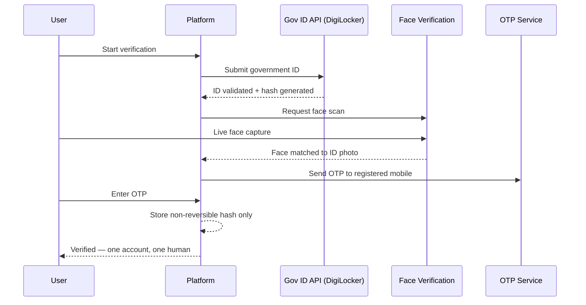
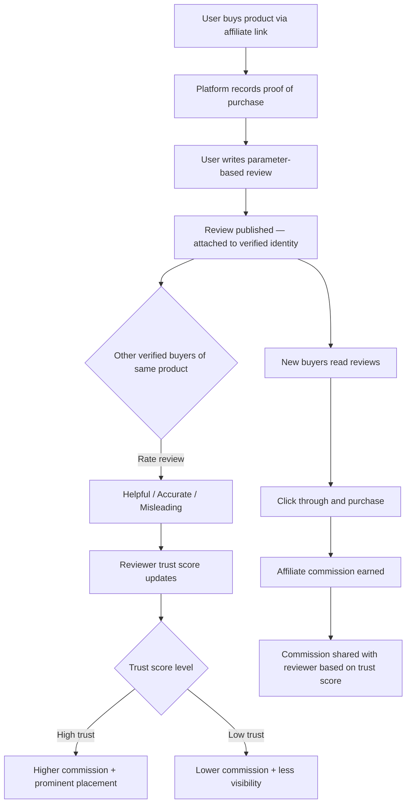
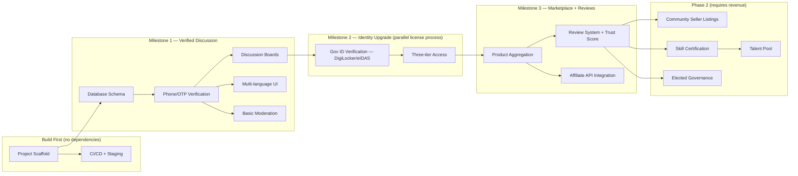
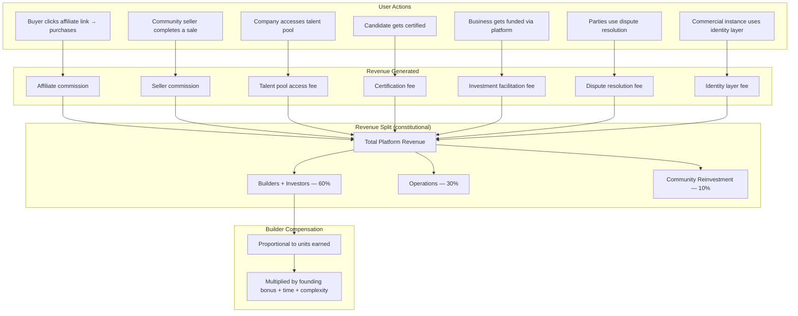

# System Diagrams

## Identity Verification Flow

```mermaid
sequenceDiagram
    participant U as User
    participant P as Platform
    participant ID as Gov ID API (DigiLocker)
    participant F as Face Verification
    participant OTP as OTP Service

    U->>P: Start verification
    P->>ID: Submit government ID
    ID-->>P: ID validated + hash generated
    P->>F: Request face scan
    U->>F: Live face capture
    F-->>P: Face matched to ID photo
    P->>OTP: Send OTP to registered mobile
    U->>P: Enter OTP
    P-->>P: Store non-reversible hash only
    P-->>U: Verified — one account, one human
```

## Review System Flow

```mermaid
flowchart TD
    A[User buys product via affiliate link] --> B[Platform records proof of purchase]
    B --> C[User writes parameter-based review]
    C --> D[Review published — attached to verified identity]
    D --> E{Other verified buyers of same product}
    E -->|Rate review| F[Helpful / Accurate / Misleading]
    F --> G[Reviewer trust score updates]
    G --> H{Trust score level}
    H -->|High trust| I[Higher commission + prominent placement]
    H -->|Low trust| J[Lower commission + less visibility]
    D --> K[New buyers read reviews]
    K --> L[Click through and purchase]
    L --> M[Affiliate commission earned]
    M --> N[Commission shared with reviewer based on trust score]
```

## Module Dependencies (Build Order)

```mermaid
flowchart LR
    subgraph "Build First (no dependencies)"
        SCAFFOLD[Project Scaffold]
        INFRA[CI/CD + Staging]
    end

    subgraph "Milestone 1 — Verified Discussion"
        PHONE[Phone/OTP Verification]
        DB[Database Schema]
        DISCUSSION[Discussion Boards]
        I18N[Multi-language UI]
        MOD[Basic Moderation]
    end

    subgraph "Milestone 2 — Identity Upgrade (parallel license process)"
        IDENTITY[Gov ID Verification — DigiLocker/eIDAS]
        TIERS[Three-tier Access]
    end

    subgraph "Milestone 3 — Marketplace + Reviews"
        MARKETPLACE[Product Aggregation]
        REVIEWS[Review System + Trust Score]
        AFFILIATE[Affiliate API Integration]
    end

    subgraph "Phase 2 (requires revenue)"
        SELLERS[Community Seller Listings]
        CERTIFICATION[Skill Certification]
        TALENT[Talent Pool]
        GOVERNANCE[Elected Governance]
    end

    SCAFFOLD --> DB
    SCAFFOLD --> INFRA
    DB --> PHONE
    PHONE --> DISCUSSION
    PHONE --> I18N
    PHONE --> MOD
    DISCUSSION --> IDENTITY
    IDENTITY --> TIERS
    TIERS --> MARKETPLACE
    MARKETPLACE --> REVIEWS
    MARKETPLACE --> AFFILIATE
    REVIEWS --> SELLERS
    REVIEWS --> CERTIFICATION
    CERTIFICATION --> TALENT
    REVIEWS --> GOVERNANCE
```

## Revenue Flow

```mermaid
flowchart TD
    subgraph "User Actions"
        A1[Buyer clicks affiliate link → purchases]
        A2[Community seller completes a sale]
        A3[Company accesses talent pool]
        A4[Candidate gets certified]
        A5[Business gets funded via platform]
        A6[Parties use dispute resolution]
        A7[Commercial instance uses identity layer]
    end

    subgraph "Revenue Generated"
        A1 --> R1[Affiliate commission]
        A2 --> R2[Seller commission]
        A3 --> R3[Talent pool access fee]
        A4 --> R4[Certification fee]
        A5 --> R5[Investment facilitation fee]
        A6 --> R6[Dispute resolution fee]
        A7 --> R7[Identity layer fee]
    end

    subgraph "Revenue Split (constitutional)"
        R1 & R2 & R3 & R4 & R5 & R6 & R7 --> POOL[Total Platform Revenue]
        POOL --> B[Builders + Investors — 60%]
        POOL --> O[Operations — 30%]
        POOL --> C[Community Reinvestment — 10%]
    end

    subgraph "Builder Compensation"
        B --> UNITS[Proportional to units earned]
        UNITS --> MULTI[Multiplied by founding bonus + time + complexity]
    end
```
