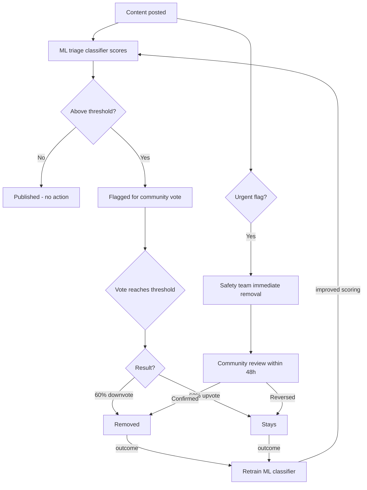
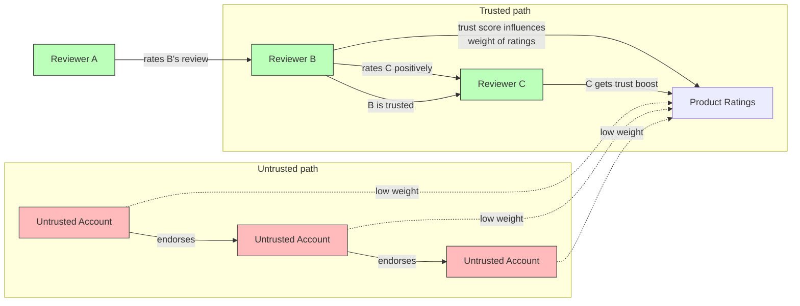

# MVP — What Gets Built First

The smallest thing that delivers real value and generates early revenue. Everything else comes after this works.

The MVP ships in three milestones. Each one is independently useful and proves a specific thesis before the next begins.

---

## Milestone 1: Verified Discussion (ships first)

**Proves:** People will use a discussion space where every participant is a verified real person.

### Verification (phone/OTP)

One phone number per account at registration. Password is the primary auth; OTP is the second factor on new devices. This is not the full identity system — it's enough to prevent bot-scale abuse and make every participant a real person with something to lose.

Full government ID verification (DigiLocker, eIDAS) comes in Milestone 2 via a KYC provider (Digio, Signzy, IDfy, or similar) — no government license needed on our end.

### Discussion Boards + Chat (E2E Encrypted)

Threaded discussion boards and group chat. Every participant is phone-verified.

**End-to-end encryption for private communication:**
- DMs and private group chats use the **MLS protocol** (RFC 9420) — the platform cannot read private messages, even under compulsion
- Public discussion boards remain unencrypted (content is public by nature)
- Group key management scales to large groups without O(n²) message overhead (MLS tree structure)
- Key transparency log: users can verify their keys haven't been tampered with

**Why E2E, not just TLS:**
If the platform can read messages, eventually someone will — government pressure, data breaches, rogue employees. E2E makes it architecturally impossible. The platform can't hand over what it can't read.

### Multi-language (UI + Real-Time Translation)

i18n support — the interface works in Hindi, English, and whatever languages the first users need. UI chrome is localized from day one.

**Real-time content translation** ships with Milestone 1. A user posts in Hindi; another reads it in English. Without this, language communities become silos that never interact — and the platform is functionally several separate platforms sharing a database.

**How it works:**
- Neural machine translation (NLLB-200 or SeamlessM4T, self-hosted) translates posts and comments on demand
- Original language always preserved and visible — translation is a layer, not a replacement
- Users flag bad translations → feeds back into model quality
- Latency target: <500ms for cached translations, <2s for new content
- Self-hosted models (not API calls to Google/DeepL) — no user content leaves platform infrastructure

**Why self-host:** Operationally complex (GPU inference, model updates, quality monitoring). But the alternative is sending all user content to Google or DeepL — which breaks the "no user data leaves our infrastructure" guarantee.

- Board creators moderate their boards initially (volunteer — builds reputation and trust)
- As a board's community grows, members elect moderators democratically — removable via no-confidence (7-day discussion + 60% vote)
- Once platform revenue is healthy, elected moderators are paid from operations budget
- Group chat for real-time coordination within communities

**Moderation (Milestone 1 — simple version):**

Board creators moderate. They can remove content and ban users from their board. All actions are logged publicly. This is sufficient for the first 1,000 users.

**Moderation (scales with growth — ML triage + human decision):**

At scale, pure human voting doesn't work — flagging fatigue, slow response to novel harm, coordinated downvote attacks. The solution: ML classifiers triage content, humans make final decisions.

**How it works:**

1. **ML triage layer** — Lightweight classifiers (fine-tuned on community norms, not generic hate-speech models) score content in real-time. Content above a threshold is auto-flagged for human review. Content is never auto-removed by ML alone (except CSAM — legal mandate).

2. **Community vote** — Flagged content (by ML or by users) opens a community vote:
   - **Upvote** — keep the content.
   - **Downvote** — remove it.

Vote threshold before action is taken (minimum votes required):
- Small boards (<100 members): 10 votes
- Medium boards (100–1000 members): 3% of active members
- Large boards (1000+ members): 1% of active members

Once the threshold is reached: **60% downvotes = content removed.** 60% upvotes = flag dismissed, content stays. Consistent with the platform's governance majority rule.

One person, one vote. Verified identity makes this viable — no sock puppets, no brigading with alt accounts.

3. **Feedback loop** — Outcomes of human votes retrain the ML models. False positives reduce confidence; confirmed violations increase it. The system gets better over time without ever making autonomous decisions.

**Why ML triage, not ML moderation:** The platform's principle is that humans govern. ML handles the triage problem (10,000 posts/day, 3 moderators can't read them all) without making removal decisions. It's a priority queue, not an authority.

**Urgent flag** — For illegal content, doxxing, active threats. Goes directly to elected safety team for immediate removal. Community reviews within 48 hours (confirms or reverses the decision).

**Anti-brigading:** Coordinated downvote detection (graph analysis on voting patterns). If 50 accounts that never interact with a board suddenly vote together, that's flagged for safety team review before the vote executes.

### Moderation Pipeline

**Legal obligations (non-negotiable, from day one):**

Indian IT Act (Section 67B) and POCSO Act require:
- **CSAM detection:** Automated scanning of all user-uploaded images/videos using PhotoDNA or equivalent hash-matching service. Content matching known CSAM hashes is blocked immediately and never stored.
- **Reporting:** Any detected CSAM must be reported to NCMEC (via CyberTipline) and Indian authorities (cybercrime.gov.in) within 24 hours.
- **Preservation:** Evidence preserved for 90 days for law enforcement (stored encrypted, not accessible to platform staff).
- **No community vote on illegal content.** CSAM, terrorism content, and court-ordered removals are not subject to the voting system. They are removed immediately and reported. This is a legal requirement, not a policy choice.

IT Rules 2021 (Intermediary Guidelines) additionally require:
- **Grievance officer** appointed and contact published on the platform.
- **Acknowledgment** of content complaints within 24 hours.
- **Resolution** of complaints within 15 days (72 hours for content affecting dignity/privacy).
- **Monthly compliance report** (once the platform reaches 50 lakh users — not required initially but the infrastructure should be ready).

These obligations exist from the moment the platform hosts user-generated content. They are not optional and cannot be deferred to "when we have resources." The automated CSAM scanning must be integrated before the discussion boards go live.

**What this means for Milestone 1 scope:** Discussion boards are not "just a forum." Legal compliance makes this heavier than it looks — PhotoDNA integration, a named grievance officer, SLA-bound complaint handling, and encrypted evidence preservation are all required before launch. This is real operational commitment from day one, not something that can be added later. Contributors should understand this going in.

---

## Milestone 2: Identity Upgrade (when Milestone 1 has traction)

**Proves:** People will go through full government ID verification voluntarily.

**Depends on:** Integration with a KYC provider (Digio, Signzy, IDfy, or similar). These companies already hold DigiLocker/Aadhaar eKYC licenses — we use their APIs. No government license needed on our end. Integration timeline: 2-4 weeks.

### Full Identity Verification

KYC provider handles government ID verification (DigiLocker in India via provider API, eIDAS in EU). Face scan for high-stakes actions. HMAC of ID number stored for deduplication (irreversible without secret key) — raw ID numbers processed in memory and immediately discarded, no personal data retained.

Existing phone-verified users are invited to upgrade. Three-tier access:
- **Verified** — full government ID. Full platform access.
- **Phone-verified** — can discuss, can't review products or vote in governance.
- **Unverified** — browse only.

The user pays the one-time verification fee. See [Identity Verification](../building/identity-verification.md) for the full proposed design.

The principle is non-negotiable. The implementation is open to improvement.

---

## Milestone 3: Marketplace + Reviews (when affiliate APIs are approved)

**Proves:** Verified reviews drive affiliate revenue.

**Depends on:** Affiliate API approval from Amazon/Flipkart (requires existing site with traffic — which Milestones 1 and 2 provide).

### Marketplace (Reviews + Discovery)

A trusted review layer on top of existing platforms.

**Aggregated listings (day one value):**

Products from major platforms (Amazon, Flipkart, etc.) are pulled via their official affiliate APIs. Users don't need to wait for sellers to list — millions of products are browsable immediately.

**How it works:**

1. Products aggregated from major platforms via affiliate APIs (Amazon Product Advertising API, Flipkart Affiliate API, etc.)
2. Verified users review products — only real humans, verified purchase
3. Peer-rated reviews surface the most helpful and accurate information
4. Users click through to buy on the source platform

**Why this works:**

- Solves cold-start — marketplace is useful from day one without waiting for sellers
- Reviews are trustworthy because every reviewer is a verified real human
- Peer-rated reviews add a quality layer that no existing platform has
- Affiliate commissions generate revenue immediately (Amazon: 1-10%, Flipkart: 4-12%)

**The progression:**

1. Start as the place for trusted reviews (aggregated products from major platforms)
2. Revenue diversifies across affiliate commissions, sponsored slots, talent pool, and certification fees
3. Community sellers list alongside later (phase 2) — free to list, small commission on sales
4. On-platform transactions added for community sellers — buyers pay no platform fee

**Default sort order:**

Products are ranked using a **Wilson score interval** (lower bound of confidence interval for the true rating):

1. Reviewed products always appear above unreviewed products
2. Among reviewed products, rank by Wilson score — this accounts for both rating quality AND sample size. A product with 3 five-star reviews does NOT outrank a product with 50 reviews averaging 4.3 stars. The math penalizes low sample sizes automatically.
3. Unreviewed products sorted by recency

**Why Wilson score, not sum/average:**
- Simple average: 5 stars from 2 reviews beats 4.3 from 200 reviews. Wrong.
- Sum of ratings: favours volume regardless of quality. Also wrong.
- Wilson score: "What's the lowest rating this product probably has, given the data?" — statistically sound, deterministic, no ML black box. Used by Reddit (for comments), Yelp, and Stack Overflow.

The formula is transparent, documented, and produces the same result for anyone who runs it. No personalization, no hidden weights.

**Revenue from day one:** Affiliate commissions when users click through and purchase on source platforms.

**API dependency risk:** Affiliate API access is granted at the provider's discretion. The platform's revenue model does not depend on any single provider long-term — seller commissions, talent pool fees, certification fees, sponsored slots, and identity layer fees are independent revenue streams. If a provider terminates access, the platform continues with remaining providers and community sellers.

**Reviewer earnings:**

Reviewers earn a share of affiliate commissions when their reviews drive clicks. Guardrails against gaming:

1. **Parameter-based reviews** — Each product category has specific parameters (e.g., phone: battery, camera, build, value for money). Reviewers must rate and justify each parameter. Vague "great product!" reviews don't qualify for commission.
2. **Commission on clicks, not sentiment** — Positive or negative doesn't matter. A detailed "don't buy this" review earns the same as a positive one. The incentive is usefulness, not positivity.
3. **Peer-rated reviews** — Other verified buyers of the same product can rate any review as helpful, accurate, or misleading. This peer validation feeds directly into the reviewer's trust score. Gaming requires multiple verified purchasers to collude — far harder than creating fake accounts.
4. **Trust score (graph-based propagation)** — Anyone who bought a product can review it immediately. Commission and review weight grow as trust builds. Trust is computed using **EigenTrust-style graph propagation** — ratings from already-trusted users carry more weight than ratings from new/untrusted users. This makes review rings and reciprocal rating schemes ineffective (colluding accounts amplify each other's low-trust signals, not high-trust ones).

   **Inputs:** peer ratings from other verified buyers, parameter accuracy vs buyer feedback, return rates of recommended products, consistency over time. **Computation:** iterative trust propagation over the reviewer-rates-reviewer graph, converging to a global trust vector. Higher trust = higher commission share and more prominent placement. Misleading reviews tank your score — and because trust propagates, tanking one account's score reduces the weight of every account that endorsed it.

You earn by being useful and accurate. Gaming requires consistently fooling buyers on specific measurable parameters — which tanks your trust score after a few attempts.

### EigenTrust Propagation

Colluding rings of untrusted accounts amplify low-trust signals, not high-trust ones. Mutual endorsement among untrusted accounts does not bootstrap credibility — it reinforces their low weight in the global trust vector.

## What's NOT in the MVP

| Feature | Why it waits |
|---------|-------------|
| Skill certification + Talent pool | Requires active community and certifiers — added once MVP has traction |
| Community seller listings | Needs trust infrastructure and moderation in place first |
| On-platform payments | Requires payment rail integration per country, compliance, dispute resolution |
| Delivery/logistics | Massive infrastructure — let existing platforms handle this for now |
| Collective purchasing | Needs critical mass of shopkeepers in same geography |
| Contract infrastructure (business funding, rentals, loans) | Requires verified identity layer and lawyer-reviewed templates |
| Political coordination | Emerges naturally once membership hits critical mass |
| Video calls (on-platform) | Use external tools initially — build later when we have the team |
| Legal infrastructure (contracts, templates, dispute resolution) | Critical for investment and business funding phases — built when those features activate |
| Translation between users (perfect quality) | Self-hosted neural MT ships with Milestone 1. Quality improves continuously via user feedback. |
| Federation | Single instance first — federation is a goal, not yet designed |

## Marketplace Listing Policy

- Aggregated products (from Amazon, Flipkart, etc.) are pulled automatically via affiliate APIs — no manual listing needed.
- Community seller listings (phase 2) — free to list, small commission on completed sales.

## Revenue Model

**Milestone 1–2: No revenue. Runs lean.**

Volunteer contributors. Minimal infrastructure costs (~₹5,000/month for hosting + OTP service). Funded by the founder or early supporters. This is the community-building phase — the product is the discussion platform, not the revenue.

**Milestone 3 (early): Revenue starts, doesn't cover costs.**

Affiliate commissions begin when users review products and click through. At small scale (5,000–10,000 users), this generates ₹1,000–5,000/month. Useful signal that the model works. Not enough to sustain anything.

**Milestone 3 (at scale, 50K+ active users): Revenue covers infrastructure.**

At this scale, affiliate click-throughs generate enough to cover hosting, OTP, and operational costs. The platform stops needing external support.

**Phase 2: Revenue diversifies and compensates builders.**

| Source | When it kicks in |
|--------|-----------------|
| Affiliate commissions | Milestone 3 (meaningful at 50K+ users) |
| Talent pool access fees (companies) | Once certified professionals exist |
| Certification fees | Once certifiers are active |
| Seller commissions | When community sellers are added |
| Identity layer fees | When commercial instances use the verification network |

Builder compensation activates when revenue consistently exceeds operating costs. Until then, contributions are tracked and owed — paid retroactively when the money exists.

## Technical Approach

- **Web app (PWA)** — Progressive Web App built with Next.js. Works on mobile browsers, installable to home screen, push notifications, app-like feel. No app store gatekeepers.
- **Native mobile app** comes later when there are contributors for it.
- **Modular monolith** — clear module boundaries designed for eventual service separation, but ships as one deployable unit for speed.

## How It Grows

**Milestone 1 (ships first):**
1. Discussion boards launch with phone verification and multi-language UI.
2. First ~1,000 users join. Community forms. Content is created.

**Milestone 2 (when Milestone 1 has traction):**
3. Government ID verification goes live. Users upgrade from phone-verified to full-verified.

**Milestone 3 (when affiliate APIs are approved):**
4. Marketplace activates with aggregated products. Verified users review products. Affiliate revenue starts.

**Phase 2 (funded by MVP revenue):**
5. Skill certification starts. Domain experts evaluate people. Talent pool forms.
6. Community sellers list alongside aggregated products.
7. Companies start paying for talent access. Revenue diversifies.
8. Revenue funds the next phase — on-platform payments, collective purchasing, investment infrastructure.

## What Success Looks Like

**Milestone 1:** Active discussion communities. Real engagement. Users returning daily.

**Milestone 2:** Majority of active users upgrade to full verification voluntarily.

**Milestone 3:** Reviews driving affiliate clicks. Revenue covering infrastructure costs.

## Phase 2: Skill Certification + Talent Pool

Once the MVP has traction and revenue:

### Skill Certification

Domain experts interview and assess people's skills. Real evaluations by real experts — not keyword-matching algorithms.

- **Certifiers** are domain experts with demonstrable knowledge, experience, or skills. Provable credentials. They're recruited personally at first, community-elected later.
- **Process:** Expert interviews the candidate, assesses their skill level, records the result on-platform.
- **Certification interviews** happen via external video tools (Google Meet, Zoom) initially. On-platform video comes later.

### Talent Pool

Companies pay a fee to access expert-certified professionals.

**How access works:** Companies see anonymized profiles — skills, certifications, experience level, domain. No personal contact details exposed. Contact happens through the platform. The professional chooses whether to respond. No bulk export, no scraping, no extracting the database.

Companies currently pay recruiters 15-25% of annual salary. The goal is comparable vetting quality at a fraction of the cost. The professional gets hired, the platform gets a fee, the certifier gets a share.
