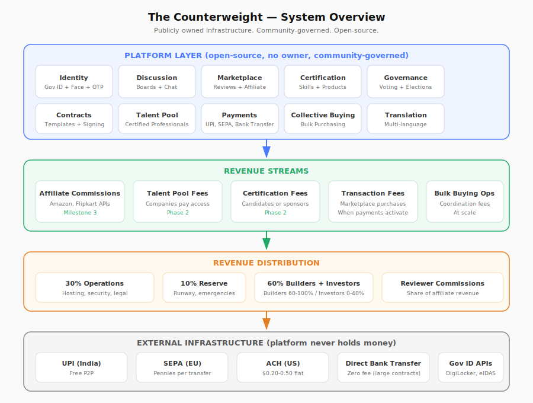

# The Counterweight — Overview

## The Problem

The internet is filling up with generated content, fake accounts, and bot interactions. It's increasingly difficult to know whether the person you're reading, reviewing, or transacting with is real. Platforms have no incentive to fix this — engagement-based revenue models don't distinguish between real and synthetic activity.

Separately, platforms can be sold or have their policies changed unilaterally. Users have no structural recourse.

## The Solution

A platform where every participant is verified through government ID — one account per human. An irrevocable purpose trust prevents sale or mission change (legally binding, same mechanism as Patagonia). Open-source.

Verified identity is the foundation. Reviews become trustable when reviewers can't create disposable accounts. Governance becomes viable when one person equals one vote. Contracts become enforceable when both parties are identified.

## Why This Scope

Looks like many products. It's one system — the pieces reinforce each other, but they don't all need to exist on day one.

**Load-bearing (must exist for the platform to function):**

Identity → trusted reviews → marketplace → revenue → builders → more features

**Amplifiers (added when the foundation is solid):**

Certification → talent pool → more revenue → contract infrastructure → collective purchasing → governance at scale → federation

The load-bearing pieces launch together as the MVP. Each amplifier is added when the previous phase generates the revenue and trust to support it.

Each feature exists somewhere already — affiliate review sites, angel networks, cooperatives, certification bodies, discussion forums. Combining them under one verified identity and governance structure is what makes the individual pieces trustable. A review platform without verified identity is just another review platform. Governance without verified identity is vulnerable to sybil attacks. The identity layer is what makes each piece work.

## What It Does

| Module | What it does |
|--------|-------------|
| Identity | Government ID + face scan + OTP = one real person per account. Identity data stays on your device (signed credential from KYC provider). Platform stores only a deduplication hash computed via OPRF — never sees raw identity data. Two paths: anonymous (pseudonym, full privacy) or public profile (reputation ledger — where you're from, what you've done, trust score, certifications). Opt-in verified attributes. ZK proofs for ecosystem. Full verification = constitutional rights. |
| Discussion | Threaded boards + chat. Every participant is a verified human. E2E encrypted DMs (MLS protocol). Real-time neural translation across languages. |
| Marketplace | Products aggregated from major platforms (affiliate APIs) + community sellers listing directly. You review with proof of purchase or as an expert. Others who buy based on your recommendation rate it — with proof of purchase. Platform calculates a helpfulness score over time. You get paid proportionally. Revenue comes from affiliate commissions. |
| Certification | Domain experts evaluate and certify skills and product quality. Selected by community. |
| Talent Pool | Companies pay to access expert-certified professionals. |
| Contracts | Enforceable agreements between verified humans — business funding, freelancer agreements, rental contracts, loans, partnerships. Platform provides templates, signing, storage, and dispute resolution. |
| Collective Purchasing | Small shops pool demand, buy direct from manufacturers at bulk prices. Platform coordinates. |
| Governance | One person, one vote on leadership and policy. Individual investment decisions are each person's own. Leaders removable via no-confidence (7-day discussion + 60% vote). |
| Payments | Money moves through existing rails (UPI, SEPA, bank transfer). Platform records, never holds or processes. |

## How It Makes Money

```
Milestone 3:  Affiliate commissions (reviews drive purchases on Amazon/Flipkart)
Phase 2:      Talent pool access fees (companies pay for certified professionals)
Phase 2:      Certification fees (candidates or sponsoring companies pay)
Phase 2:      Seller commissions (when community sellers are added)
At scale:     Collective purchasing operational fees
```

Milestones 1-2 generate no revenue — they build the community and trust. Revenue starts at Milestone 3 (marketplace + affiliate APIs). Phase 2 features are funded by Milestone 3 revenue. Community-owned.

## How Money Flows

**Early stage (pre-quorum):** The founder has operational authority within the defined formula. Anyone can contribute capital as risk capital — recorded permanently, recognized under governance-decided terms when revenue flows. The full bicameral voting process activates once membership hits 10,000 verified members. Until then, early funding operates under constitutional bounds with founder authority and independent-body oversight on disputes. See [Funding Model](../joining/funding-model.md) for full details.

**Starting split:** 60% builders + investors | 30% operations | 10% community reinvestment. Investor share is capped and time-bounded. At scale, governance decides the split — no pre-set formula locks in what doesn't make sense yet. See [Funding Model](../joining/funding-model.md) for full details.

## How Contributors Get Paid

Contributions are tracked. Units = hours × complexity × (1 + sum of bonuses).

- Complexity: 1x-30x based on skill level required (deliberately above market rate — compensates for no equity and risk of units being worth nothing)
- Bonuses are additive: Year 1 (+100%), first-10 contributor (+100%), critical path (+50%), first-of-kind (+50%)
- Maximum effective multiplier: 120x (absolute ceiling). Typical strong early contribution: 40-80x.
- Revenue flows to contributors proportional to their share of total units
- All assignments are public, challengeable, and require verifiable artifacts

## The System Diagram



[View full size](https://raw.githubusercontent.com/thecounterweight/platform/main/docs/assets/system-diagram.svg)

## What's Built vs What's Planned

| Status | Component |
|--------|-----------|
| Live | Landing page + signup (thecounterweight.org) |
| Designed | Identity verification, payments, contracts, certification, marketplace strategy |
| Not started | All platform code (backend, frontend, mobile) |

## Tech Stack (Proposed)

- **Frontend:** Next.js (PWA — installable, push notifications)
- **Backend:** Next.js API routes + standalone workers (TypeScript, modular monolith)
- **Database:** PostgreSQL (single instance, schemas per module)
- **Cache:** Redis (sessions, rate limiting, real-time presence)
- **Background Jobs:** BullMQ (Redis-backed)
- **Search:** Meilisearch or Typesense (added when marketplace launches)
- **Storage:** Cloudflare R2 or MinIO (S3-compatible)
- **Hosting:** Vercel (frontend) + Railway or Fly.io (workers/db) + GPU instance (translation/ML inference)
- **Translation:** NLLB-200 or SeamlessM4T (self-hosted, GPU inference)
- **Trust Engine:** EigenTrust graph propagation (reviewer trust scoring)
- **E2E Encryption:** MLS protocol (RFC 9420) for DMs and group chat
- **CI/CD:** GitHub Actions

## Read More

- [Vision](vision.md) — the full picture
- [MVP](mvp.md) — what gets built first
- [Builder Compensation](../joining/builder-compensation.md) — how you get paid
- [Identity Verification](../building/identity-verification.md) — how one-person-one-account works
- [Payments](../building/payments.md) — how money moves
- [Contracts](../building/contracts.md) — contract infrastructure for verified humans
- [Contributing](../../CONTRIBUTING.md) — how to start
